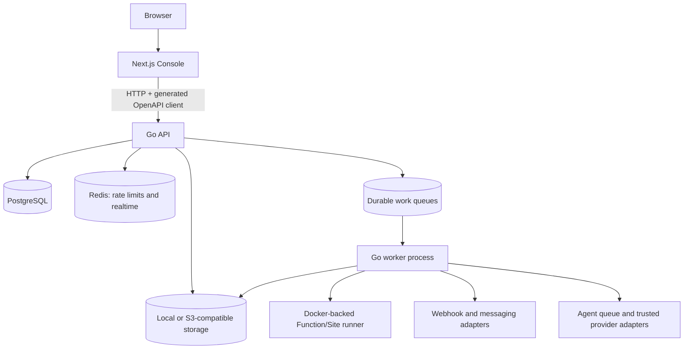

# Stealth

[](https://github.com/Stealth-deplover/stealth/actions/workflows/ci.yml)
[](https://go.dev/dl/)
[](LICENSE)

## The open-source developer cloud

Stealth is a self-hostable developer platform for deploying applications,
Functions, Sites, databases, object storage, messaging, webhooks, and agent
workflows on infrastructure you control. It combines a Go control plane and
worker process with a Next.js console and versioned Docker Compose deployments.

> **Current status:** early public preview. Agent configuration and durable run
> lifecycle are implemented, but execution is queue-only until a trusted
> provider adapter is installed. Stealth is licensed under Apache-2.0; see
> [License](#license).

**Navigate:** [Quick Start](#quick-start) · [Documentation](docs/README.md) ·
[Architecture](#architecture) · [Self Hosting](#self-hosting) ·
[Roadmap](#roadmap) · [Contributing](CONTRIBUTING.md)

## Quick Start

The CLI installer is the supported release path. The bootstrap script is
read through GitHub Raw's `HEAD` reference, so it follows the repository's
current default branch when that branch is renamed to `main`.

The latest stable release is `v0.1.0`. Read the [release notes](https://github.com/Stealth-deplover/stealth/releases/tag/v0.1.0)
before installing, and use [Upgrade and rollback](docs/upgrade.md) for
operational changes and recovery boundaries.

Supported host: Linux amd64 or arm64 with Docker Engine, Docker Compose v2,
access to `/var/run/docker.sock`, and a writable installation directory.
Public deployments also need DNS and TLS termination in front of the bundled
proxy.

```bash
curl -fsSL https://raw.githubusercontent.com/Stealth-deplover/stealth/HEAD/scripts/bootstrap.sh | sh
```

The bootstrap verifies the downloaded archive and SHA-256 checksum, then
starts the interactive `stealth install` flow. To invoke the installed CLI
directly, run `stealth install`. It generates private configuration and
secrets, pulls matching API/worker/migration/Console images, applies
migrations, starts the stack, and checks health and readiness. Open the public
instance URL entered in the installer afterward. The default local proxy,
Console, and API ports are `8080`, `13000`, and `18080` respectively.

See [Production deployment](docs/production-deployment.md) and the
[CLI guide](docs/cli.md) for the supported self-hosting path.

## Development

The backend uses Go 1.26, PostgreSQL, and Redis:

```bash
cp .env.example .env
go run ./cmd/api       # API on http://localhost:8080
go run ./cmd/worker
go vet ./...
go test ./... -count=1
```

The console uses Node 24 and talks directly to the Go API:

```bash
cd console
cp .env.example .env.local
npm ci
npm run api:generate
npm run dev             # Console on http://localhost:3000
```

Run `npm run typecheck`, `npm run lint`, `npm run test`, `npm run build`, and
`npm run test:e2e` before submitting console changes. The OpenAPI client is
generated from [`openapi/openapi.yaml`](openapi/openapi.yaml); never edit
`console/src/api/generated/` by hand.

## Architecture



The API owns authentication, tenant boundaries, and the REST contract. The
Console has no second business-logic backend. The worker owns asynchronous
builds, execution, delivery, realtime publication, and optional Agent runs.

## Documentation

Use the [documentation index](docs/README.md) for setup, architecture,
configuration, operations, upgrades, backups, and known Console/backend
boundaries. The [OpenAPI contract](openapi/openapi.yaml) is the source of
truth for Console requests.

## Self Hosting

The portable baseline is Docker Compose: a reverse proxy serves the standalone
Next.js Console and sends `/v1/*` to the Go API. PostgreSQL stores durable
control-plane data; Redis supports rate limits and realtime delivery; the
worker runs queued builds and integrations. The bundled local storage mode is
single-host; use an S3-compatible store for a more durable production setup.
Read [Production deployment](docs/production-deployment.md) before exposing
an instance publicly.

## Roadmap

The statuses below describe the current implementation, not a promise of
managed-service availability.

| Area                             | Status       | Current scope                                                                                                  |
| -------------------------------- | ------------ | -------------------------------------------------------------------------------------------------------------- |
| Authentication and organizations | Beta         | Account sessions, recovery, memberships, invitations, audit data                                               |
| Projects                         | Beta         | Project lifecycle, users, API keys, service layout, scoped access                                              |
| Functions                        | Beta         | Source archives, Docker-backed builds/execution, variables, logs, quotas                                       |
| Sites                            | Beta         | Static deployments, Git source, domains, publication, build logs                                               |
| Database                         | Beta         | Tables, rows, indexes, relationships, exports, backups, restore                                                |
| Storage                          | Beta         | Buckets/files, quotas, local or S3-compatible drivers                                                          |
| Messaging                        | Beta         | Providers, topics, subscribers, queued delivery, retry adapters                                                |
| Webhooks                         | Beta         | Signed delivery, transactional outbox, retries, SSRF protections                                               |
| Observability                    | Beta         | Health/readiness, metrics, traces, realtime events, audit records                                              |
| Self-host installer              | Experimental | Interactive CLI and release artifacts are published; full clean-host validation remains release-gated, and upgrade remains a documented operator runbook |
| Agents                           | Experimental | Configuration, catalog, durable runs, logs, and cancellation; provider execution remains queue-only by default |
| Production hardening             | Beta         | Leases, bounded retries, rate limits, proxy trust, smoke checks; HA and exactly-once execution are not claimed |

## Releases

Tags must currently match `vMAJOR.MINOR.PATCH`. The release workflow publishes
coordinated GHCR images for API, worker, migration, and Console plus Linux
amd64/arm64 CLI archives and `checksums.txt` after production smoke checks.
The latest stable release is `v0.1.0`; see the [release notes](https://github.com/Stealth-deplover/stealth/releases/latest),
[Release engineering](docs/release.md), the [release checklist](docs/RELEASING.md),
and [Upgrade and rollback](docs/upgrade.md). The installer still requires a
clean-host validation pass, and upgrades remain an operator-runbook workflow.

## Screenshots

No product screenshots are committed yet. The most useful first captures would
be a project dashboard, Function deployment, Database tables, an Agent run
showing its queue-only state, and Observability/traces. Add redacted captures
only when they reflect the current product; see the [maintainer release
checklist](docs/RELEASING.md#screenshots-and-social-preview) for naming and
privacy guidance.

## Contributing

Read [CONTRIBUTING.md](CONTRIBUTING.md), the [Code of Conduct](CODE_OF_CONDUCT.md),
the root [Repository Guidelines](AGENTS.md), and [`console/AGENTS.md`](console/AGENTS.md)
for development and review rules.

## Security

See [SECURITY.md](SECURITY.md) for responsible disclosure guidance. Never
commit `.env` files, session secrets, API keys, provider credentials, or private
values in `NEXT_PUBLIC_*` variables.

## License

Stealth is licensed under the [Apache License 2.0](LICENSE).
